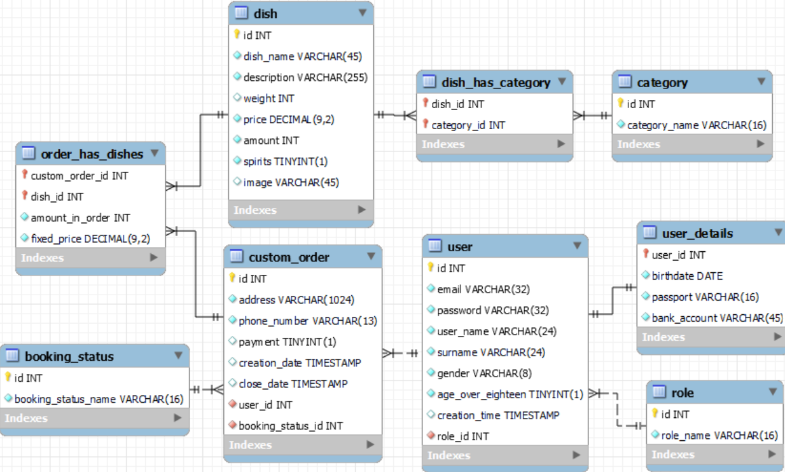

# Restaurant
## Task/Завдання
There are roles: Client, Manager.
The client (authorized user) places orders from the menu - the catalog of dishes,
and also has the opportunity to view the catalog taking into account the sorting:
 - by the name of the dish;
 - by cost;
 - by category
 - and filters the list of dishes by category.
 The customer, within one order, can order several identical dishes.
The manager manages the orders: after receiving a new order, sends it for cooking. After cooking,
the Manager passes the order for delivery. After delivery and receiving payment,
the Manager changes the status of the order to "completed".

### Database Schema:

## Реалізація
### *Сторінки проекту*
#### *Доступні відвідувачу:*
##### - Index, або головна сторінка
##### - Сторінка меню
##### - Сторінка входу або реєстрації
#### *Доступні клієнту:*
##### - Index, або головна сторінка
##### - Сторінка меню
##### - Кошик, або сторінка зі списком замовленнь клієнта
#### *Доступні менеджеру:*
##### - Index, або головна сторінка
##### - Сторінка меню
##### - Замовлення, або сторінка зі списком замовленнь всіх клієнтів
##### - Сторінка, на якій менеджер може додати нову страву

### *Index*
 Містить список страв деяких категорій меню, кожна з категорій відображається при натисканні
 відповідної клавіші. Для кожної страви відображається наступна інформація:
- назва страви;
- її опис;
- ціна;
- вага;
- клавіша "Замовити" (для менеджера клавіша недоступна).
 При натисканні на цю клавішу незареєстрований користувач потрапляє на сторінку реєстрації.
 Для клієнта при настисканні відобрається додаткове меню із інформацією для замовлення:
  * назва страви котру клієнт хоче замовити;
  * її опис;
  * ціна;
  * вага;
  * поля для введення адреси та телефону доставки (відобрається лише при замовленні першої страви у поточному замовленні,
    надалі вважається що адреса і телефон доставки для даного замовлення ті ж самі.);
  * випадаючий список для вибору кількості страв (відображається реальна кількість кожної зі страв що доступні
    до замовлення.);
  * клавіша "продовжити замовлення", при натисканні якої поточна страва додається до списку поточного замовлення,
    але користувач залишається на цій же сторінці;
  * клавіша "замовити страву", при натисканні якої поточна страва додається до списку поточного замовлення,
    але користувач переходить на сторінку списку своїх замовлень;
  * перед доданням кожної страви до замовлення, проводиться перевірка, чи має користувач право на купівлю алкогольних
    напоїв. Якщо замовляється спиртний напій користувачем до 18 (що користувач зазначає під час реєстрації),
    виводиться відповідне повідомлення.
  * можливість закрити дане меню, не роблячи замовлення.
***(Таке ж відображення страв та функціонал має сторінка "Меню")***

### *Сторінка меню*
Має такий же функціонал як і сторінка *Index*, але додатково містить:
- відображення усіх категорій меню, фільтрація здійснюється за категоріями, список страв 
  кожної із категорій надається при натисканні відповідної клавіші;
- відображення спеціальних пропозицій (ці страви також можуть бути присутні у будь якій 
  із категорій, відношення категорія-страва "Many-To-Many", якщо розглядати відображення
  в базі даних);
- можливіть відображати усі страви, при цьому сортувати їх за назвою, за ціною або ж за категорією меню.
- в менеджера, замість клавіші "замовити", з'являється клавіша "редагувати", де менеджер має можливість як 
    редагувати саму страву, так і її кількість в меню. Страви кількість яких менеджер встановив нуль,
    клієнту (не зареєстрованому користовачеві) в меню відображатись не будуть.

### *Сторінка входу або реєстрації*
Фізично одна і та ж сторінка для авторизації та реєстрації, але юзер може обрати її вигляд:
* форма входу (відображається як дефолтна), є можливіть натиснути клавішу "Зареєструватись",
  при цьому форма входу ховається, і відображається форма реєстрації;
* форма реєстрації, є клавіша для повернення відображення форми входу, при цьому форма реєстрації 
  знову приховується.

#### Форма реєстрації:
Знизу, під формою, користувач отримує повідомлення при невірному заповненні форми:
 - підказку щодо невірного заповнення паролю;
 - пароль підтвердження не співпадає;
 - про те що стать (чол. жін.) не вибрана;
 - про те, що користувач з такою електронною адресою існує.
Паролі з сервера до корисувача не повертаються, і при введенні приховуються, але є можливість їх
перегляду у будь якому з полів введення окремо, натиснувши відповідну клавішу.
Решта підказок щодо невірного заповнення з'являєються у відповідних полях форми (ім'я, прізвище, електронна
адреса).
Якщо частина полів пройшли верифікацію - то вони виводяться у поля, таким чином користувач не вводить
їх повторно, але верифікація при повторному надсиланні форми на стороні сервера повторюється.
Після успішної реєтрації користувач відразу авторизується. Вводити дані у форму авторизації не потрібно.

### *Кошик, або сторінка зі списком замовленнь клієнта*
Доступна лише зареєстрованим клієнтам. Містить список усіх замовлень, в тому числі поточного, ще не сформованого (не підтвердженого) замовлення.
Для кожного із замовлень відображається наступна інформація:
 - дата формування замовлення;
 - список всіх страв що клієнт обрав для замовлення, кожна страва містить:
   * назву;
   * опис страви;
   * ціну;
   * вагу;
   * кількість;
   * клавішу "Видалити" страву із замовлення (лише для непідтверджених замовлень). При видаленні останньої 
     страви із замовлення, дана страва видаляється разом із замовленням.
 - статус замовлення (лише для підтверджених клієнтом замовлень);
 - сума до сплати (лише для непідтверджених замовлень, або замовлень що мають статус "Чекає на оплату"):
   * для непідтверджених замовлень вартість вираховується із врахуванням вартості кожної страви на поточний час;
   * для замовлень що підтверджені користувачем, вартість фіксується на час підтвердження замовлення.
   
      *Якщо розглянути збереження замовлень в базі даних, то кожна страва у замовленні має фіксовану ціну
      (поле "fixed_price" таблиці "order_has_dishes"), вартість страв заноситься в це поле при формуванні замовлень.
      Але при оновленні даної сторінки вартість кожної страви у непідтвердженому замовленні береться із таблиці "dish",
      поле "price". Ідея полягає в тому, що користувач може додати страву у замовлення задовго до підтвердження цього
      замовлення, а вартість страви може змінитись. Але при підтвердженні замовлень, вартість страви фіксується у
      відповідному полі.*
   
 - поля з інформацією адреси доставки замовлення (лише для непідтверджених замовлень);
 - клавіша продовжити замовлення (лише для непідтверджених замовлень);
 - клавіша оплатити замовлення (лише для замовлень що мають статус "Чекає на оплату");

Якщо клієнт ще немає замовлень, на сторінці відображається відповідне повідомлення та деяка інформація про ресторан.

### *Замовлення, або сторінка зі списком замовленнь всіх клієнтів*
Доступна лише менеджерам. Містить:
 - клавіші вибору сортування замовлень:
    * за датою;
    * за статусом замовлення.
 - для кожного із замовлень дату оформлення замовлення;
 - адресу та телефон клієнта;
 - статус замовлення;
 - список страв із зазначенням назви страви, її вартості, ваги, кількості для кожної із страв;
 - загальна сума замовлення;
 - клавіші для зміни статусу замовлення ("Відправити на приготування", "Віправити клієнту", "Запит на оплату",
   "Замовлення виконано");
 - пагінація, котра включає вибір кількості замовлень для відображення на сторінці, клавіші "Назад", "Вперед"
    та клавіші з номерами сторінок.

### *Бокова панель навігаці*
Однакова для кожної зі сторінок, але різна для незареєстрованого відвідувача, для користувача або ж менеджена.
Містить навігацію по доступних сторінках, та клавіші вибору мови сайту (українська або англійська). Інформація
що зберігається в базі даних не перекладається, але повідомлення помилок, та іншої інформації що надсилається 
користувачеві відображаються з врахуванням вибору мови клієнтом.